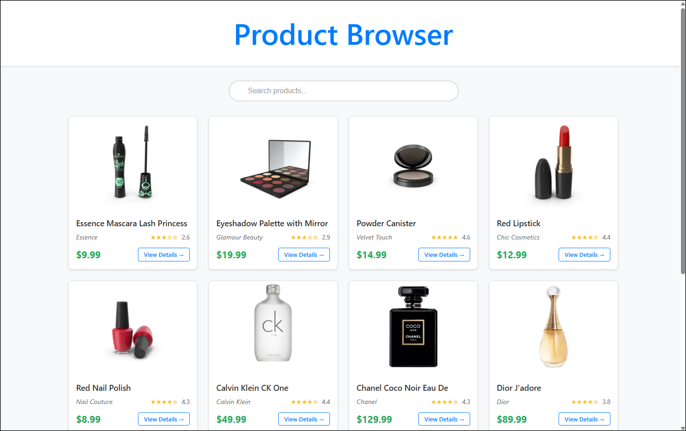
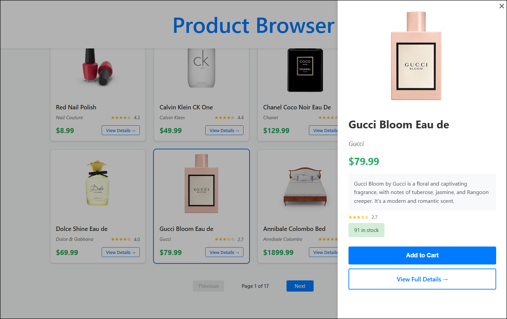
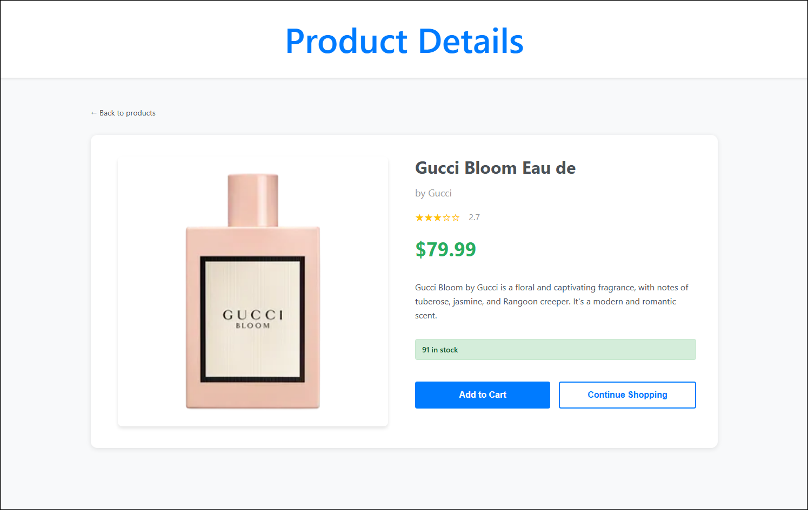

# Product Browser Application

**[🔗 View Live Demo](https://lindenholt-whittaker.github.io/ProductBrowser/)**

A full-stack web application for browsing and searching products. This application showcases modern web development practices with a React frontend and .NET backend.

This application provides a responsive product browsing experience with search functionality, pagination, and detailed product views. The backend serves as a proxy to the DummyJSON API, adding caching and normalization layers for improved performance.







## Project Structure

```
ProductBrowser/
├── product-browser/     # Frontend - React/TypeScript application
├── ProductAPI/         # Backend - .NET 8 Web API
└── ProductAPI.Tests/   # Backend unit tests
```

## Components

### Frontend (product-browser)
React 19 application built with TypeScript and Vite.

[View Frontend README](./product-browser/README.md)

### Backend (ProductAPI)
A .NET 8 Web API.

[View Backend README](./ProductAPI/README.md)

## Quick Start

### Prerequisites
- Node.js 21+
- .NET 8 SDK
- npm or yarn

### Running the Application

1. **Start the Backend API:**
```bash
cd ProductAPI
dotnet run
```
The API will be available at http://localhost:5000 by default

2. **Start the Frontend:**
```bash
cd product-browser
npm install
npm run dev
```
The application will be available at http://localhost:3000 by default

### Running Tests

**Backend Tests:**
```bash
cd ProductAPI.Tests
dotnet test
```

**Frontend Tests:**
```bash
cd product-browser
npm test
```

## Development Setup

1. Clone the repository
2. Follow the setup instructions in each project's README
3. Ensure ports for backend and frontend are available
4. Backend must be running before starting the frontend

## Known Limitations

- Cart functionality is UI-only (not implemented)
- API endpoint is hardcoded in frontend
- Limited test coverage on frontend components
- Lack of accessibility considerations in UI
